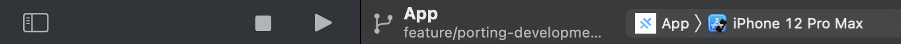

# APPorta_PoC

## First Step - Install deps

- Check if you have IONIC installed on your machine (if not check this guide: https://ionicframework.com/docs/intro/cli)
- Versions on our machines:
  - `node@14.16.1`
  - `ionic@6.18.2`
- Check to have the last version of `XCode` installed

After having check if you have `node` and `ionic` installed lanch `npm i`.

## Set TEMPLATE_ID and ENVIROMENT

- open `src/environments/environment.ios-production.ts`
- set the values of:
  - `PERSONA_ENVIRONMENT`: `production` or `sandbox`
  - `PERSONA_TEMPLATE_ID`: your template ID

## Building iOS APP

- `cd scripts`
- `sh build-production.sh`
- It'll open XCode automatically

## XCode

- Select the emulator and click on play
  
